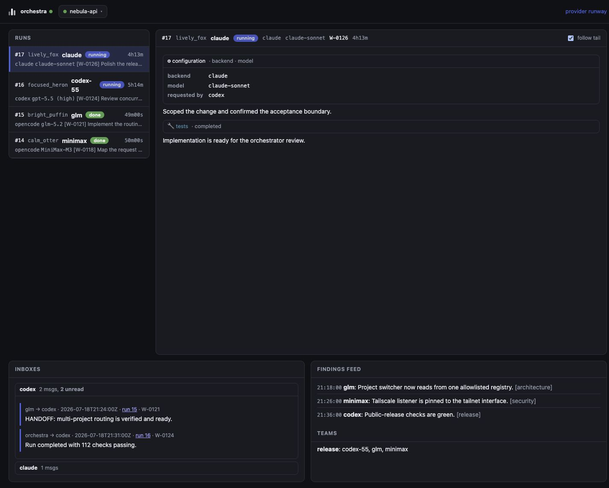
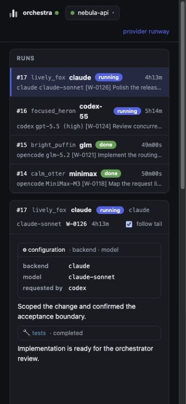

<p align="center">
  
</p>

<p align="center">
  A local control plane for people who delegate software work across Codex, Claude Code, and OpenCode agents.
</p>

Orchestra turns agent CLIs into a coordinated team. Dispatch work without blocking your terminal, keep each worker's session available for follow-ups, and watch every project from one dashboard. Runs survive the orchestrator session that created them, while inboxes, findings, and optional [slash-work](https://github.com/batteryshark/slash-work) items keep the handoff durable.



> Screenshots use fictional projects, prompts, and provider balances. They contain no private workspace information.

## What it does

- Dispatches independent or parallel runs to Codex, Claude Code, and OpenCode backends.
- Gives every run a memorable name such as `brisk_otter`; numeric run IDs remain the authoritative reference.
- Resumes the same agent session with `reply`, or redirects it safely between actions with `interrupt`.
- Coordinates workers through inboxes, teams, and a shared findings feed.
- Keeps backend and model configuration visible in the run details pane.
- Registers many project roots behind one long-running dashboard and project picker.
- Keeps normalized coding-plan headroom in a compact dashboard rail with an expandable provider drawer, without sending credentials to the browser.
- Serves on loopback by default or on the machine's Tailscale address when explicitly requested.

## Install from source

Orchestra supports macOS and Linux and requires Python 3.11 or newer,
[uv](https://docs.astral.sh/uv/), and at least one authenticated agent CLI.
Windows is supported through WSL by running Orchestra and its worker harnesses
inside the same Linux distribution; native Windows execution is out of scope.
See [Linux and Windows through WSL](docs/linux-wsl.md) for the supported
boundary, filesystem guidance, and operational notes.

```sh
git clone https://github.com/batteryshark/orchestra.git
cd orchestra
uv tool install --editable .
orchestra doctor
```

Initialize a project from its root:

```sh
cd /path/to/project
orchestra init
```

Add `--work` if the optional `work` CLI is installed and you want Orchestra to initialize its tracker too. `init` creates local `.orchestra/` state and an orchestrator playbook; it also registers the root with the shared dashboard registry.

## Dispatch and coordinate

```sh
orchestra dispatch --to glm --as codex "implement the parser and add tests"
orchestra dispatch --to glm --to minimax --as codex "review this independently"
orchestra dispatch --to kimi --allow-question --as codex "implement the risky migration"
orchestra status
orchestra wait
orchestra inbox codex --unread --mark-read
orchestra reply 7 "good; now cover malformed input"
orchestra interrupt 8 "stop—the schema changed" --as codex
orchestra interrupt 8 "stop immediately" --now --as codex
orchestra logs 7 --pretty
```

Attach a run to a slash-work item with `--work W-0003`. Dispatch and completion events are then logged to that item, and the worker brief asks the agent to record progress and verification evidence there.

Use `--worktree` to give a worker an isolated Git worktree on an `orchestra/run-N` branch. Orchestra carries the project's agent instructions and skill folders into that worktree so delegated tools retain their context.

Workers remain fully autonomous by default. For a mission where a wrong assumption could be destructive or waste substantial work, `--allow-question` grants that run one blocking question. The worker must provide a recommended fallback; Orchestra stops its model process, pauses the execution timeout, sends the question to the dispatcher's inbox, and resumes the same session after `orchestra answer RUN "..."`. If nobody answers, the declared fallback is applied automatically after 30 minutes. Override that bounded window per dispatch with `--question-wait SECONDS` or globally with `settings.question_wait_timeout`.

`orchestra interrupt` waits for the next completed action boundary reported by the active backend before stopping and resuming the worker, so routine redirection does not terminate a tool during a file write. OpenCode step finishes, Codex completed tool items, and Claude tool results are recognized. Use `--now` only when stopping immediately is more important than preserving the current tool operation. If the worker exits before another boundary, Orchestra resumes the same session immediately with the pending message. Periodic supervisor check-ins use the same safe path.

## Hand off a wave to another orchestrator

An orchestration wave is resumable by a fresh session of the same orchestrator, or by a different one entirely, without depending on the leaving orchestrator's conversation state. Two commands do the work:

```sh
# Planned exit (you're about to stop). --work anchors recovery: the
# successor's objective is derived from `work show W-XXXX --json`.
orchestra checkpoint --as codex --work W-0010 \
  --objective "land W-0010; review diff before merge" \
  --next "merge the worktree branch after review" \
  --next "run full test suite"

# Abrupt exit (provider exhausted, session lost — run it once you
# realise you can't continue). --objective is optional: --work still
# anchors the objective via `work show --json`, and falls back to the
# highest-priority active work item if that's also unavailable.
orchestra checkpoint --as codex --work W-0010
```

`checkpoint` writes a small bounded JSON file under `.orchestra/checkpoints/`. It records durable intent (objective, next steps, source identity, anchored `--work` item) plus **high-water marks** — the largest run / message / feed IDs observed at write time — not a frozen copy of every active row. Free-text fields (objective, next steps, run titles, work titles, feed tags, bodies) are redacted for credential patterns before they land on disk.

The successor picks it up with:

```sh
orchestra takeover --as claude
# or, when multiple sources have checkpoints:
orchestra takeover --from codex --as claude
# or, an explicit path:
orchestra takeover --checkpoint .orchestra/checkpoints/codex-...json --as claude
```

`takeover` opens the project DB in SQLite URI `mode=ro` (no schema, no migrations, no WAL writes to the source file) and re-queries it for everything that happened **after** the checkpoint's high-water marks, then renders a markdown cold-start brief. The brief is strictly read-only — no source DB row is inserted, updated, or marked read. Bodies are redacted before they enter a checkpoint AND re-sanitized on render as defense in depth.

## One dashboard, many projects

Start the UI from any initialized project:

```sh
orchestra ui
```

The process reads a user-level project registry on every request, so projects can be added while it is already running:

```sh
orchestra project register /path/to/another-project
orchestra project list
orchestra project forget PROJECT_ID
```

Use the project picker in the header to switch roots. The UI only accepts projects already present in the registry; browsers cannot submit arbitrary filesystem paths. Forgetting a project removes the registry entry and never deletes project files or `.orchestra/` data.



### Tailnet access

```sh
orchestra ui --tailscale
```

This binds only to the machine's Tailscale IPv4 address and prints the resulting URL. The default UI binds to loopback. Orchestra has no application-level authentication, so tailnet ACLs determine who can view registered projects, prompts, transcripts, logs, and stop active runs. Review [SECURITY.md](SECURITY.md) before enabling it.

Port `4764` is preferred. An implicit port may safely fall back when busy; an explicit `--port` is pinned and fails instead. `--tailscale` cannot be combined with an explicit `--host`.

## Provider runway

The dashboard's right-side runway rail keeps the current headroom for configured MiniMax, Moonshot AI (Kimi Code), Claude, Z.AI, and Codex accounts visible while you work. Select a provider—or the Usage button on narrower screens—to open quota windows and refresh controls without leaving the dashboard. Existing `/runway` bookmarks open this drawer. Collection happens server-side and the browser receives only normalized usage state—never API keys, access tokens, or credential-file contents.

`orchestra usage` prints the same state in the terminal. Before dispatch, Orchestra can warn when a target's known coding-plan headroom is at or below 20 percent. The advisory never reroutes a run and fails open if usage is unavailable. Disable it with `quota_warn = false` or `--no-quota-warn`.

Claude usage refreshes from Claude Code's live `/usage` view in the background. If that endpoint is unavailable or rate-limited, Orchestra labels the card cached and hides the old percentages instead of presenting them as current.

## Configuration

Global configuration lives at `~/.config/orchestra/config.toml`; a project's `.orchestra/config.toml` overlays it. Run `orchestra doctor` to check configured backends, models, executable availability, and configured optional integrations.

Roster entries choose a backend (`opencode`, `codex`, or `claude`), model, and optional arguments. Session references are recorded so `orchestra reply` resumes the same worker rather than starting over. Environment passthrough is opt-in through `env_passthrough`; Orchestra does not ship with private credential names enabled.

The default roster includes `kimi` and `kimi-max`, both backed by OpenCode's `kimi-for-coding/k3` model. The first is the flagship generalist for complex coding, long-context, and visual work; `kimi-max` enables the max-thinking variant for hard design and integration work. Override or remove those entries in the normal global or project roster config if a Kimi Code plan is not connected.

### Optional OpenCode Ensemble integration

Ordinary OpenCode workers do not require OpenCode Ensemble, and Orchestra does not include an Ensemble agent in the default roster. To opt into nested OpenCode teams, first add the separately maintained plugin to the `plugin` list in `~/.config/opencode/opencode.json`:

```json
{
  "plugin": ["@hueyexe/opencode-ensemble@0.16.0"]
}
```

Then add an explicit roster entry to `~/.config/orchestra/config.toml` or `.orchestra/config.toml`:

```toml
[agents.ensemble]
backend = "opencode"
model = "zhipuai-coding-plan/glm-5.2"
ensemble = true
role = "lead of an OpenCode Ensemble team"
model_pool = ["zhipuai-coding-plan/glm-5.2", "minimax-coding-plan/MiniMax-M3"]
```

After restarting OpenCode, run `orchestra doctor`, then dispatch with `orchestra dispatch --to ensemble ...`. Orchestra starts its persistent OpenCode host automatically for an Ensemble run. If the configured plugin is absent, dispatch fails before creating a run. The dashboard reads Ensemble's SQLite state through a read-only optional adapter and remains functional when that database is absent or incompatible.

## How state is divided

- `.orchestra/` in each project stores its SQLite run state, project configuration, and durable handoff checkpoints.
- Supervised workers can create native child runs with `orchestra spawn --to AGENT "mission"`.
  Child ownership is distinct from backend session follow-ups, works across OpenCode, Codex,
  and Claude runners, and is shown hierarchically in the dashboard. Children use isolated git
  worktrees by default; Orchestra reports their branches and never auto-merges them. Defaults
  are deliberately bounded by `settings.child_max_depth`, `child_max_per_run`, and
  `child_max_active` (1, 3, and 3). Stopping a lead cascades to its active descendants.
- The user-level registry stores project identifiers and roots for the shared UI.
- `ORCHESTRA.md` is the generated orchestrator playbook; agent instruction files point to it.
- Optional slash-work data remains the durable task and decision record.

The dashboard is read-mostly. Dispatch, reply, interrupt, registry changes, and most mutations stay in the CLI; the run details pane can stop an active run using the same cancellation path as `orchestra kill`.

## Development

```sh
python3 -W error::ResourceWarning -m unittest discover -s tests -v
uv build
```

The package has no runtime Python dependencies. UI assets are bundled in the wheel.
Pull requests and `main` are verified on Ubuntu with Python 3.11 and 3.13.

## Security and license

Read [SECURITY.md](SECURITY.md) for the network boundary and private reporting instructions. Orchestra is available under the [MIT License](LICENSE).
