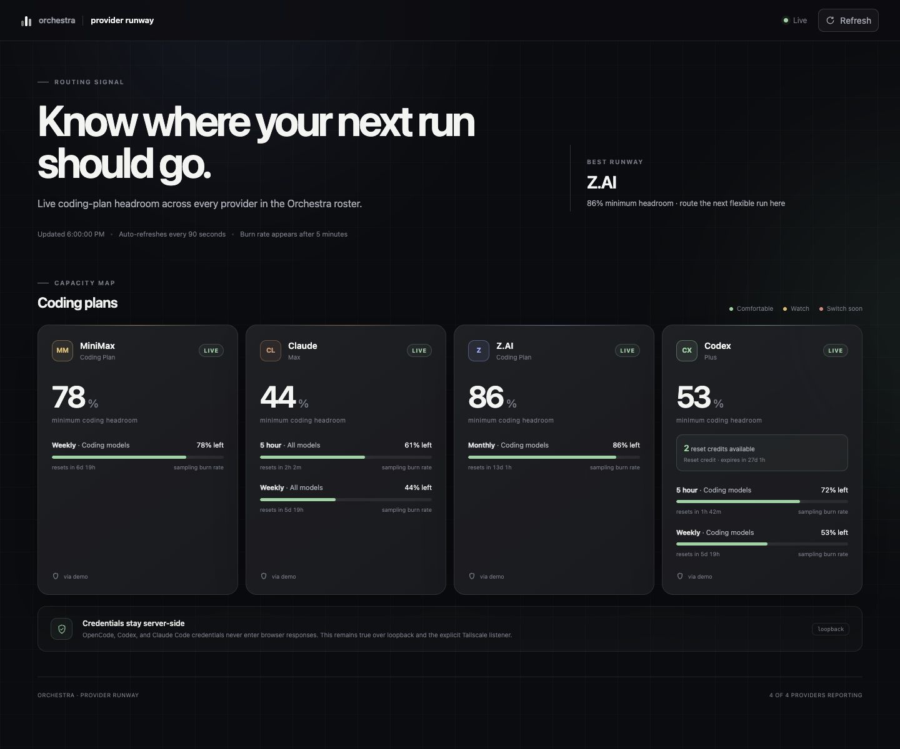

<p align="center">
  
</p>

<p align="center">
  A local control plane for people who delegate software work across Codex, Claude Code, and OpenCode agents.
</p>

Orchestra turns agent CLIs into a coordinated team. Dispatch work without blocking your terminal, keep each worker's session available for follow-ups, and watch every project from one dashboard. Runs survive the orchestrator session that created them, while inboxes, findings, and optional [slash-work](https://github.com/batteryshark/slash-work) items keep the handoff durable.


> Screenshots use fictional projects, prompts, and provider balances. They contain no private workspace information.

## What it does

- Dispatches independent or parallel runs to Codex, Claude Code, and OpenCode backends.
- Gives every run a memorable name such as `brisk_otter`; numeric run IDs remain the authoritative reference.
- Resumes the same agent session with `reply`, or redirects it immediately with `interrupt`.
- Coordinates workers through inboxes, teams, and a shared findings feed.
- Keeps backend and model configuration visible in the run details pane.
- Registers many project roots behind one long-running dashboard and project picker.
- Shows normalized coding-plan headroom on a separate provider runway without sending credentials to the browser.
- Serves on loopback by default or on the machine's Tailscale address when explicitly requested.

## Install from source

Orchestra requires Python 3.11 or newer, [uv](https://docs.astral.sh/uv/), and at least one authenticated agent CLI.

```sh
git clone https://github.com/batteryshark/orchestra.git
cd orchestra
uv tool install --editable .
orchestra doctor
```

Initialize a project from its root:

```sh
cd /path/to/project
orchestra init
```

Add `--work` if the optional `work` CLI is installed and you want Orchestra to initialize its tracker too. `init` creates local `.orchestra/` state and an orchestrator playbook; it also registers the root with the shared dashboard registry.

## Dispatch and coordinate

```sh
orchestra dispatch --to glm --as codex "implement the parser and add tests"
orchestra dispatch --to glm --to minimax --as codex "review this independently"
orchestra status
orchestra wait
orchestra inbox codex --unread --mark-read
orchestra reply 7 "good; now cover malformed input"
orchestra interrupt 8 "stop—the schema changed" --as codex
orchestra logs 7 --pretty
```

Attach a run to a slash-work item with `--work W-0003`. Dispatch and completion events are then logged to that item, and the worker brief asks the agent to record progress and verification evidence there.

Use `--worktree` to give a worker an isolated Git worktree on an `orchestra/run-N` branch. Orchestra carries the project's agent instructions and skill folders into that worktree so delegated tools retain their context.

## One dashboard, many projects

Start the UI from any initialized project:

```sh
orchestra ui
```

The process reads a user-level project registry on every request, so projects can be added while it is already running:

```sh
orchestra project register /path/to/another-project
orchestra project list
orchestra project forget PROJECT_ID
```

Use the project picker in the header to switch roots. The UI only accepts projects already present in the registry; browsers cannot submit arbitrary filesystem paths. Forgetting a project removes the registry entry and never deletes project files or `.orchestra/` data.


### Tailnet access

```sh
orchestra ui --tailscale
```

This binds only to the machine's Tailscale IPv4 address and prints the resulting URL. The default UI binds to loopback. Orchestra has no application-level authentication, so tailnet ACLs determine who can view registered projects, prompts, transcripts, logs, and stop active runs. Review [SECURITY.md](SECURITY.md) before enabling it.

Port `4764` is preferred. An implicit port may safely fall back when busy; an explicit `--port` is pinned and fails instead. `--tailscale` cannot be combined with an explicit `--host`.

## Provider runway

The dashboard links to `/runway`, which combines cached coding-plan quota from configured MiniMax, Claude, Z.AI, and Codex accounts. Collection happens server-side and the browser receives only normalized usage state—never API keys, access tokens, or credential-file contents.



`orchestra usage` prints the same state in the terminal. Before dispatch, Orchestra can warn when a target's known coding-plan headroom is at or below 20 percent. The advisory never reroutes a run and fails open if usage is unavailable. Disable it with `quota_warn = false` or `--no-quota-warn`.

Claude usage refreshes from Claude Code's live `/usage` view in the background. If that endpoint is unavailable or rate-limited, Orchestra labels the card cached and hides the old percentages instead of presenting them as current.

## Configuration

Global configuration lives at `~/.config/orchestra/config.toml`; a project's `.orchestra/config.toml` overlays it. Run `orchestra doctor` to check configured backends, models, executable availability, and relevant plugins.

Roster entries choose a backend (`opencode`, `codex`, or `claude`), model, and optional arguments. Session references are recorded so `orchestra reply` resumes the same worker rather than starting over. Environment passthrough is opt-in through `env_passthrough`; Orchestra does not ship with private credential names enabled.

## How state is divided

- `.orchestra/` in each project stores its SQLite run state and project configuration.
- The user-level registry stores project identifiers and roots for the shared UI.
- `ORCHESTRA.md` is the generated orchestrator playbook; agent instruction files point to it.
- Optional slash-work data remains the durable task and decision record.

The dashboard is read-mostly. Dispatch, reply, interrupt, registry changes, and most mutations stay in the CLI; the run details pane can stop an active run using the same cancellation path as `orchestra kill`.

## Development

```sh
python3 -W error::ResourceWarning -m unittest discover -s tests -v
uv build
```

The package has no runtime Python dependencies. UI assets are bundled in the wheel.

## Security and license

Read [SECURITY.md](SECURITY.md) for the network boundary and private reporting instructions. Orchestra is available under the [MIT License](LICENSE).
