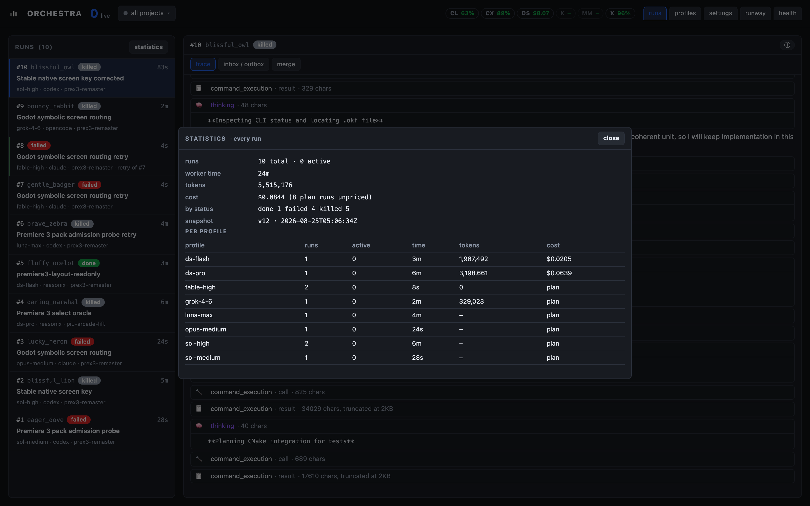

<picture>
  <source media="(prefers-color-scheme: dark)" srcset="assets/orchestra-wordmark-dark.svg">
  
</picture>

## What this is

Orchestra is the execution side of an agentic project: one dispatcher that
brings every harness and every model under one roof.

For humans and agents: a unified dispatcher that takes work on request or by
programmatic dispatch, routes it, and completes bounded or complex exploratory
work with full logging, handoffs, controls, escalation, and tool homogeneity.
Plug in models and profiles, let them delegate to teams with tooling, and get
complex work done reliably. New model? New tools? Plug them in. It does not
depend on one harness, and it does not depend on extracting content out of a
provider's harness: all your content lives under one roof. Its planning
counterpart is Work.

**Orchestra — one dispatcher, many runners, one problem.**

Orchestra is a local control plane that turns agent CLIs — Codex, Claude Code,
OpenCode, Reasonix — into a coordinated team. It takes delegated items from
Work, runs each one in its own git worktree, supervises it to completion, and
lands the verified result on the base branch.

## Why a worktree per run

One agent in your checkout does one thing at a time, and the checkout is why.
Two agents editing the same files collide with each other, and either of them
collides with you while you are editing. Orchestra gives each run its own git
worktree on its own branch, `orchestra/run-N`, so a dozen runs can work on one
repository at once and none of them can see or overwrite what another is doing.
Your own checkout is not one of the worktrees they get.

A branch still has to come back. When a run finishes, the supervisor verifies it
in this order: the repository's declared checks — test, lint, build — then
mechanical tripwires for files touched outside the project, deletions and
oversized diffs, then a cheap agent review of the diff against the item's
acceptance criteria when criteria exist. Only then does the branch land, in a
scratch worktree, and the base ref moves by compare-and-swap so a base that
moved underneath refuses instead of overwriting. A repository that declares no
checks lands on tripwires alone, which is a weaker guarantee than it sounds:
declaring a test command is what makes automatic landing worth trusting.

You watch all of it happen. The daemon serves a dashboard that streams every
run's trace live, and from the same page you send a running agent a correction
or stop new dispatch entirely.

## What it looks like

Captions and the full set: [`docs/screenshots/`](docs/screenshots/README.md).





## What you need

- Python 3.11 or later and [uv](https://docs.astral.sh/uv/). Orchestra runs on the
  standard library and SQLite, and installs no other runtime dependency.
- git, and a repository to work in.
- At least one agent CLI — `codex`, `claude`, `opencode` or `reasonix` —
  installed and signed in by you. Orchestra drives the CLI you already
  authenticate. It holds no provider credentials of its own.
- Work, the companion app that holds items and the project list. A directory
  takes its project identity from Work, so `orchestra dispatch` refuses in a
  directory Work does not know. This is the requirement with no substitute.
- macOS for `orchestra service`, which installs a launchd LaunchAgent. The daemon
  itself runs in the foreground anywhere.

One machine, one daemon, one workspace of repositories. The daemon binds to this
machine's Tailscale address, or to loopback when it has none, which is the reach
it is built for.

## Install

```
git clone https://github.com/batteryshark/orchestra
cd orchestra
uv sync
```

## First run

1. Prepare the central home at `~/.orchestra/` and install the harness hooks.

   ```
   uv run orchestra init
   ```

2. Check that the harnesses and the config are healthy. It names what is
   missing, including a harness whose hook did not install.

   ```
   uv run orchestra doctor
   ```

3. Add a launch profile. A bare `--backend`, `--model` or `--effort` offers the
   list the installed harness reports, so nothing is typed from memory.

   ```
   uv run orchestra profiles discover
   uv run orchestra profiles set fast --backend --model --effort --tier 1
   ```

4. Send a run.

   ```
   uv run orchestra dispatch --to fast --worktree "Fix the failing auth test"
   ```

5. Watch it.

   ```
   uv run orchestra status
   uv run orchestra runs --active
   uv run orchestra show 1
   ```

## Run the control plane

```
uv run orchestra daemon                     # foreground
uv run orchestra service install --start    # launchd LaunchAgent, local.orchestra.daemon
```

The dashboard is served at `/` on port 3011, and the daemon prints its address
at startup. Every route, reads included, requires the key — as the
`X-Orchestra-Key` header, or as `?key=` on a first visit in a browser.
`orchestra init` writes that shared secret into the config file at mode 0600 and
prints it once; it is what the browser and the iOS client hold.

From the dashboard you send a running agent an instruction, delivered at its
next safe action boundary, and you pause dispatch so nothing new starts while
in-flight runs continue. Two things have no button:

```
uv run orchestra check 7            # stall, loop, and an out-of-band observer turn
uv run orchestra kill 7
```

## Install it as a command

`uv run orchestra` works from a clone. To have `orchestra` on your path everywhere,
while still editing the code:

```
uv tool install --editable .
```

The tool runs from the working tree, so a code change takes effect the next
time the command starts — there is no reinstall step. Restart the daemon to
pick one up:

```
orchestra service restart
```

Under launchd that kickstarts the agent. With a daemon you started by hand,
there is no supervisor to restart anything, so it says what is running and
leaves it to you.

### Teach an agent to drive it

`skills/orchestra/` is a skill for Claude Code and anything that reads the same
format. Symlink it so it tracks the repository:

```
ln -sfn "$PWD/skills/orchestra" ~/.claude/skills/orchestra
```

It covers registering a project, dispatching, watching a trace, sending a
correction, and landing a branch, and it says plainly that dispatch returning
means a run *started* rather than succeeded.

## Where things live

| What | Where |
|---|---|
| State: database, briefs, logs, worktrees | `~/.orchestra/` |
| Database | `~/.orchestra/orchestra.db` |
| Config | `~/.config/orchestra/config.toml` |
| Run branches | `orchestra/run-N` |
| Environment overrides | `ORCHESTRA_*` |
| Work agent identity | `orchestra` |

## The repository

| Path | What |
|---|---|
| `orchestra/` | the package, one module per subsystem: `dispatch`, `supervise`, `merge`, `observer`, `sweeper`, `runway` |
| `orchestra/dashboard.html` | the whole dashboard, one hand-written file, no build step |
| `ios/` | the iOS client |
| `assets/` | the mark and the wordmark; `assets/README.md` says where each goes |
| `docs/screenshots/` | the images above, each captioned in its own README |
| `docs/investigations/` | dated research records, kept as written |
| `tests/`, `run_tests.py` | the suite |
| `DESIGN.md` | every subsystem, decided, with the decision history at the end |

`uv run orchestra --help` lists every command; `uv run orchestra <command> --help`
explains one.

## License

MIT. See [LICENSE](LICENSE).
