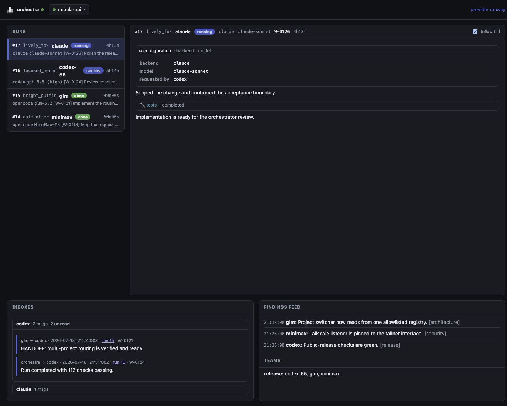
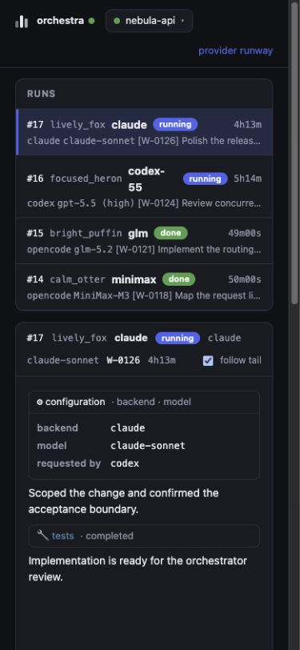

<p align="center">
  
</p>

<p align="center">
  A local control plane for people who delegate software work across Codex, Claude Code, and OpenCode agents.
</p>

Orchestra turns agent CLIs into a coordinated team. Dispatch work without blocking your terminal, keep each worker's session available for follow-ups, and watch every project from one dashboard. Runs survive the orchestrator session that created them, while inboxes, findings, and optional [slash-work](https://github.com/batteryshark/slash-work) items keep the handoff durable.



> Screenshots use fictional projects, prompts, and provider balances. They contain no private workspace information.

## What it does

- Dispatches independent or parallel runs to Codex, Claude Code, and OpenCode backends.
- Gives every run a memorable name such as `brisk_otter`; numeric run IDs remain the authoritative reference.
- Resumes the same agent session with `reply`, or redirects it safely between actions with `interrupt`.
- Coordinates workers through inboxes, teams, and a shared findings feed.
- Keeps backend and model configuration visible in the run details pane.
- Registers many project roots behind one long-running dashboard and project picker.
- Keeps normalized coding-plan headroom in a compact dashboard rail with an expandable provider drawer, without sending credentials to the browser.
- Serves on loopback by default or on the machine's Tailscale address when explicitly requested.

## Install from source

Orchestra supports macOS and Linux and requires Python 3.11 or newer,
[uv](https://docs.astral.sh/uv/), and at least one authenticated agent CLI.
Windows is supported through WSL by running Orchestra and its worker harnesses
inside the same Linux distribution; native Windows execution is out of scope.
See [Linux and Windows through WSL](docs/linux-wsl.md) for the supported
boundary, filesystem guidance, and operational notes.

```sh
git clone https://github.com/batteryshark/orchestra.git
cd orchestra
uv tool install --editable .
orchestra doctor
orchestra discover
```

Initialize a project from its root:

```sh
cd /path/to/project
orchestra init
```

Add `--work` if the optional `work` CLI is installed and you want Orchestra to initialize its tracker too. `init` creates local `.orchestra/` state and an orchestrator playbook; it also registers the root with the shared dashboard registry.

The canonical playbook is a readable, packaged template at
[`orchestra_cli/templates/ORCHESTRA.md`](orchestra_cli/templates/ORCHESTRA.md). It defines
generic coordination doctrine—ownership boundaries, task sizing, worker briefs, handoffs,
verification gates, messaging, and recovery—followed by a project-owned section for domain
methodology and completion rules. `AGENTS.md` and `CLAUDE.md` receive concise pointers to that
single source instead of duplicate instructions.

Newer playbooks mark Orchestra's generic section explicitly. Refresh that section without
overwriting project doctrine with:

```sh
orchestra init --refresh-playbook
```

Ordinary `orchestra init` always preserves an existing `ORCHESTRA.md`. A legacy playbook that
predates the managed markers is also never guessed at or overwritten: refresh exits with an
instruction to migrate its custom doctrine manually into a newly generated template.

## Dispatch and coordinate

```sh
orchestra dispatch --to glm --as codex "implement the parser and add tests"
orchestra dispatch --to minimax --after 7 --as codex "review run 7's output"
orchestra dispatch --to glm --to minimax --as codex "review this independently"
orchestra dispatch --to kimi --allow-question --as codex "implement the risky migration"
orchestra status
orchestra wait
orchestra inbox codex --unread --mark-read
orchestra interrupt 7 "The parser is length-prefixed, not delimiter-based" --as codex
orchestra resume 7 "good; now cover malformed input"
orchestra queue 8 "afterward, update the compatibility test" --as codex
orchestra recall 42 --as codex
orchestra interrupt 8 "stop—the schema changed" --as codex
orchestra interrupt 8 --file correction.md --as codex
orchestra interrupt 8 "stop immediately" --now --as codex
orchestra cancel 9
orchestra logs 7 --pretty
```

Attach a run to a slash-work item with `--work W-0003`. Dispatch and completion events are then logged to that item, and the worker brief asks the agent to record progress and verification evidence there.

Use `--worktree` to give a worker an isolated Git worktree on an `orchestra/run-N` branch. Orchestra carries the project's agent instructions and skill folders into that worktree so delegated tools retain their context.

Use repeatable `--after RUN_ID` options when a run consumes another run's output. Orchestra
records the dispatch as `pending`, shows its unresolved prerequisites as `pending-on-N`, and
launches it exactly once after every prerequisite finishes successfully. A failed, timed-out,
or cancelled prerequisite declines the dependent dispatch without starting its worker. Pending
dispatches are cancellable with `orchestra cancel RUN`; worktree setup is deferred until launch
so it starts from the post-prerequisite repository state.

Workers remain fully autonomous by default. For a mission where a wrong assumption could be destructive or waste substantial work, `--allow-question` grants that run one blocking question. The worker must provide a recommended fallback; Orchestra stops its model process, pauses the execution timeout, sends the question to the dispatcher's inbox, and resumes the same session after `orchestra answer RUN "..."`. If nobody answers, the declared fallback is applied automatically after 30 minutes. Override that bounded window per dispatch with `--question-wait SECONDS` or globally with `settings.question_wait_timeout`.

An unattended Claude tool denial uses the same bounded question lifecycle automatically. Orchestra records the rejected tool request, asks the run's requester for guidance, and resumes the saved session with the answer. If nobody answers, it retries without the denied request using a safer non-destructive alternative. A second denial terminates with an actionable summary instead of repeatedly pausing. Claude stream interruptions are also identified explicitly rather than being collapsed into a generic exit-143 failure.

Every supervised worker also has `orchestra consult "<question>"` for ordinary,
correctable uncertainty. Consultation is non-blocking: Orchestra addresses the run's recorded
requester, the worker continues on its documented assumption, and the requester can inject
guidance with `orchestra interrupt RUN "..."`. A child consultation is routed directly to its
exact active lead run at a safe action boundary; Orchestra never guesses among runs that happen
to share a profile. Consultations without an active supervised lead remain durable requester
inbox messages. `orchestra wait` returns early when one of its target runs consults, so an
interactive orchestrator can answer promptly and then resume waiting. For a contained Operator
run, the consultation is recorded for controller/owner review; revised instructions and retries
remain controller-owned rather than bypassing the approved authority contract.

For ambiguity where continuing would be unsafe or materially wasteful, a supervised worker can
use `orchestra consult "<question>" --wait SECONDS --fallback "<safe assumption>"`. This uses
the same bounded pause/resume lifecycle as an opted-in dispatch question, but is also available
to spawned children. Blocking remains explicit: ordinary `consult` stays non-blocking, the
fallback is mandatory, and each run gets at most one blocking question.

`orchestra send AGENT "message"` uses the same safe-boundary delivery when that profile has one active run. It binds the message to the recipient's run, stops after a completed action, and resumes the same session with the text injected into its prompt. If several active runs share the profile, pass `--run`; Orchestra refuses to guess. With no active run, the message remains profile-wide mail for the next run to claim.

`orchestra interrupt` is the explicitly run-addressed form. It waits for the next completed action boundary reported by the active backend before stopping and resuming the worker, so routine redirection does not terminate a tool during a file write. OpenCode step finishes, Codex completed tool items, and Claude tool results are recognized. Use `--file PATH` for complete multiline UTF-8 corrections without shell quoting, and `--now` only when stopping immediately is more important than preserving the current tool operation. If the worker exits before another boundary, Orchestra resumes the same session immediately with the pending message. Periodic supervisor check-ins use the same safe path.

`orchestra queue` prints the queued message ID, which also appears in run details. Recall an obsolete follow-up with `orchestra recall MESSAGE_ID --as SENDER` before the current run finishes. Recall and auto-delivery are atomic: once the follow-up has been claimed for session resume, Orchestra refuses to recall it.

`orchestra resume RUN "message"` continues the run's existing backend session without reopening its immutable execution record. Orchestra creates a new run attempt linked through `parent_run`; if the selected run already has completed continuations, it resumes the latest attempt in that chain. An active continuation is never resumed concurrently. The older `orchestra reply` spelling remains as a compatibility alias.

## Design an Operator contract

The first Operator control-plane slice turns an autonomy discussion into a
strict, versioned authority contract. Start with a registered project ID and
an explicit goal and acceptance gate:

For a conversation-first setup, paste the reusable
[Operator bootstrap prompt](docs/operator-bootstrap-prompt.md) into a new
Claude, Codex, or other orchestrator task. It requires an interview and
contract preview before any explicit approval or launch.

```sh
orchestra project list
orchestra operator template "Release readiness" \
  --project PROJECT_ID \
  --goal "complete the bounded release backlog" \
  --gate "the full project test suite passes" \
  --non-goal "redesign unrelated architecture" \
  --output operator-contract.json

# Refine scope, authority, budgets, routing, escalation, and completion,
# then validate and store an immutable version.
orchestra operator validate operator-contract.json
orchestra operator draft operator-contract.json

# Use the exact version and SHA-256 printed by `draft`.
orchestra operator approve OPERATOR_ID --version 1 --hash SHA256
orchestra operator show OPERATOR_ID
orchestra operator list
orchestra operator export OPERATOR_ID --version 1 --output approved-contract.json
```

Contracts reject unknown fields, credential-bearing keys, unregistered project
references, unbounded resource settings, quality-tier downgrades, and attempts
to delegate non-negotiable actions such as history rewrites or deletion of
unique work. Drafts and approvals are immutable; amendments create a new
version and return the Operator to `awaiting_approval`. Approval is deliberately
not activation. An operation starts only when its contract and roster policy
are both owner-approved:

For multi-project live work, use the generated
`orchestra.operator-contract/v2` shape and refine it before approval:

- every goal declares exactly one writable `project_id`;
- `depends_on` records dispatch and integration order;
- `requires_review` is an explicit contract decision, not a keyword guess;
- `scope.project_rules` contains repository-relative include/exclude rules for
  each project;
- `read_dependencies` names projects copied from exact Git commits into
  bounded, hashed, isolated snapshots.

Legacy v1 contracts remain readable, but live v1 activation is fail-closed when
more than one project is scoped.

```sh
# Infer the current roster, review the file, then approve its exact hash.
orchestra operator roster bootstrap --output roster-policy.json
orchestra operator roster draft roster-policy.json
orchestra operator roster approve --version 1 --hash SHA256

# Start creates a queued operation. It is not "running" until a contained
# implementation or review run actually exists.
orchestra operator start OPERATOR_ID --mode shadow
orchestra operator status OPERATION_ID

# Live requires a direct bounded verifier for every project.
orchestra operator start OPERATOR_ID --mode live
orchestra operator decisions OPERATION_ID
orchestra operator answer DECISION_ID approve
orchestra operator pause OPERATION_ID
orchestra operator resume OPERATION_ID
```

The background controller is deterministic, lease-held, and restartable. Each
operation pins both its approved contract and approved roster. Before any
dispatch, admission proves that every goal has a structurally qualified
contained implementer and—when required—an independent reviewer pair. New
contract or roster versions never alter an existing operation.

Capacity exhaustion, temporary provider unavailability, foreign runners,
dirty or wrong-branch integration checkouts, and disk admission pressure set
the operation to `waiting` with a persisted reason. They do not consume an
attempt, create an action, invoke a model, open a decision, or restart the
operation. The controller retries automatically. `needs_decision` is reserved
for structural admission failures, containment violations, authority or
evidence changes, baseline drift after work begins, and exhausted real worker
attempts.

Live recovery councils are not executed. Legacy council fields remain readable
for contract compatibility, but the controller never responds to congestion or
failed routing by creating more workers.

Live workers currently require a Codex profile using the `workspace-write`
sandbox. OpenCode and Claude profiles are excluded from live routing because
their configured launch modes do not provide an enforceable filesystem write
boundary. Operator workers run in lightweight standalone clones whose Git
metadata is local to the clone; unlike ordinary linked worktrees, they do not
need the integration checkout as an additional writable directory. Workers
leave their filesystem delta uncommitted; after the sandboxed process exits,
the trusted broker size-checks and commits that delta before review. Review and
review runs use `read-only`. Worker-requested child runs and ad-hoc session
continuations are denied—the controller owns fan-out and retries—and any
undeclared child, escaping symlink, or background process surviving its backend
causes containment shutdown and an owner decision. The supervisor also
measures each live workspace while it runs, terminates it at the contract byte
ceiling, and preserves it for inspection instead of retrying into more disk
growth.

The canonical contract bytes, project binding snapshot, approval, and audit
events live in the owner-private user control plane at
`~/.config/orchestra/operator.db` (override with
`ORCHESTRA_OPERATOR_DB`). The full controller and roster design is documented
in [Orchestra Operator](docs/operator-design.md).

## Hand off a wave to another orchestrator

An orchestration wave is resumable by a fresh session of the same orchestrator, or by a different one entirely, without depending on the leaving orchestrator's conversation state. Two commands do the work:

```sh
# Planned exit (you're about to stop). --work anchors recovery: the
# successor's objective is derived from `work show W-XXXX --json`.
orchestra checkpoint --as codex --work W-0010 \
  --objective "land W-0010; review diff before merge" \
  --next "merge the worktree branch after review" \
  --next "run full test suite"

# Abrupt exit (provider exhausted, session lost — run it once you
# realise you can't continue). --objective is optional: --work still
# anchors the objective via `work show --json`, and falls back to the
# highest-priority active work item if that's also unavailable.
orchestra checkpoint --as codex --work W-0010
```

`checkpoint` writes a small bounded JSON file under `.orchestra/checkpoints/`. It records durable intent (objective, next steps, source identity, anchored `--work` item) plus **high-water marks** — the largest run / message / feed IDs observed at write time — not a frozen copy of every active row. Free-text fields (objective, next steps, run titles, work titles, feed tags, bodies) are redacted for credential patterns before they land on disk.

The successor picks it up with:

```sh
orchestra takeover --as claude
# or, when multiple sources have checkpoints:
orchestra takeover --from codex --as claude
# or, an explicit path:
orchestra takeover --checkpoint .orchestra/checkpoints/codex-...json --as claude
```

`takeover` opens the project DB in SQLite URI `mode=ro` (no schema, no migrations, no WAL writes to the source file) and re-queries it for everything that happened **after** the checkpoint's high-water marks, then renders a markdown cold-start brief. The brief is strictly read-only — no source DB row is inserted, updated, or marked read. Bodies are redacted before they enter a checkpoint AND re-sanitized on render as defense in depth.

## One dashboard, many projects

Start the system-wide UI from any directory:

```sh
orchestra ui
```

The current directory does not need to be an Orchestra project. The process
reads the user-level registry at `~/.config/orchestra/projects.json` on every
request, so projects can be added while it is already running. `orchestra init`
registers a project automatically; projects can also be managed explicitly:

```sh
orchestra project register /path/to/another-project
orchestra project list
orchestra project forget PROJECT_ID
```

Use the project picker in the header to switch roots. The UI only accepts projects already present in the registry; browsers cannot submit arbitrary filesystem paths. Forgetting a project removes the registry entry and never deletes project files or `.orchestra/` data.

Use **Restart server** in the dashboard header after changing Orchestra's
Python code. The listener closes and reopens on the same URL; supervised runs
are separate processes and keep running. UI-only edits still need only a page
refresh. `Ctrl-C` also closes the listening socket before the CLI exits.



### Tailnet access

```sh
orchestra ui --tailscale
```

This binds only to the machine's Tailscale IPv4 address and prints the resulting URL. The default UI binds to loopback. Orchestra has no application-level authentication, so tailnet ACLs determine who can view registered projects, prompts, transcripts, and logs; stop active runs; and restart the dashboard server. Review [SECURITY.md](SECURITY.md) before enabling it.

Port `4764` is preferred. An implicit port safely falls back when another
process—including an already-running Orchestra dashboard—still owns it; an
explicit `--port` is pinned and fails instead. `--tailscale` cannot be combined
with an explicit `--host`.

## iOS companion app

The native SwiftUI app in [`ios/`](ios/) is a remote console for one Orchestra
dashboard. Orchestra continues to run on your Mac or another machine; the app
uses that instance's project registry and JSON APIs to switch projects, watch
workers, inspect transcripts, read inboxes and findings, check provider usage,
view runtime stats, and stop active runs.

To run it:

1. Start the dashboard with `orchestra ui --tailscale`.
2. Open `ios/Orchestra.xcodeproj` in Xcode, choose your development team, and
   run the `Orchestra` scheme on an iPhone or iPad.
3. Enter the full URL printed by the dashboard, including `http://` or
   `https://`. The app stores this non-secret URL locally and restores the last
   selected project.

The app targets iOS 17 and pauses its three-second dashboard polling loop while
backgrounded. Provider usage refreshes on demand; run and Ensemble transcript
screens follow their selected worker every two seconds while visible. Because
the dashboard has no application-level authentication, keep using tailnet ACLs
to control access, as described in [SECURITY.md](SECURITY.md).

## Provider runway

The dashboard's right-side runway rail keeps the current headroom for configured MiniMax, Moonshot AI (Kimi Code), Claude, Z.AI, and Codex accounts visible while you work, and can show Together AI's prepaid USD balance when `TOGETHER_ORG_ID` is available. Select a provider—or the Usage button on narrower screens—to open quota windows and refresh controls without leaving the dashboard. Existing `/runway` bookmarks open this drawer. Collection happens server-side and the browser receives only normalized usage state—never API keys, access tokens, or credential-file contents.

Together credentials are read from OpenCode's `togetherai` connection (or `TOGETHER_API_KEY`). Its organization-level balance also requires the non-secret `TOGETHER_ORG_ID`. The balance is live account data; the adjacent spend value is deliberately labeled with the selected Orchestra project because it sums only Together-backed OpenCode costs recorded in that project's run logs.

`orchestra usage` prints the same state in the terminal. Before dispatch, Orchestra can warn when a target's known coding-plan headroom is at or below 20 percent. The advisory never reroutes a run and fails open if usage is unavailable. Disable it with `quota_warn = false` or `--no-quota-warn`.

Claude usage refreshes from Claude Code's live `/usage` view in the background. While a refresh is pending or unavailable, Orchestra keeps the last known percentages visible, labels them cached, and reports their age instead of presenting them as current.

## Configuration

Global configuration lives at `~/.config/orchestra/config.toml`; a project's `.orchestra/config.toml` overlays it. Run `orchestra doctor` for full installation health or `orchestra discover` for the live execution catalog. `orchestra discover TEXT` searches model IDs, `--json` returns the credential-free structured report, and `--refresh` asks OpenCode to refresh its model catalog.

Roster entries are reusable launch profiles, not singleton workers or capacity slots. Each profile chooses a backend (`opencode`, `codex`, or `claude`), model, reasoning configuration, role, and optional arguments; every dispatch creates a distinct run, so several independent runs may use the same profile concurrently. Choose a wave by task fit and current `orchestra usage` headroom rather than trying to keep exactly one of each profile active. Profiles can share a provider quota, and usage data is advisory, so routing still requires judgment about model strengths, weaknesses, risk, and project concurrency limits. Session references are recorded so `orchestra resume` continues the same worker context rather than starting over. Environment passthrough is opt-in through `env_passthrough`; Orchestra does not ship with private credential names enabled.

Roster entries may also set an integer `tier`. When both a parent and proposed child have tiers,
`orchestra spawn` refuses a child above the parent's tier and directs the worker to consult its
requester instead. If either tier is omitted, spawning remains unconstrained for backward
compatibility.

### Suggested role and effort mapping

The following is a cost-aware starting point for explicit per-role profiles,
not a routing guarantee or a quality-floor downgrade. Keep independent review
separate from implementation and adjust the roster from measured results on
your own workloads.

| Role | Claude Code | Codex | Kimi K3 |
|---|---|---|---|
| Architect | `claude-opus-5` / `high` | `gpt-5.6-sol` / `xhigh` | `kimi-for-coding/k3` / `max` |
| Scout | `claude-opus-5` / `low` | `gpt-5.6-luna` / `max` | — |
| Implementer | `claude-opus-5` / `medium` | `gpt-5.6-terra` / `max` | `kimi-for-coding/k3` / `max` |
| Specialist | `claude-opus-5` / `high` | `gpt-5.6-sol` / `max` | `kimi-for-coding/k3` / `max` |
| Reviewer | `claude-opus-5` / `high` | `gpt-5.6-sol` / `xhigh` | `kimi-for-coding/k3` / `max` |
| Review downgrade | `claude-opus-5` / `medium` | `gpt-5.6-sol` / `high` | — |

Set `effort` on Codex or Claude roster entries. OpenCode providers use
`variant` instead. Kimi K3 is a useful max-thinking alternative for complex
architecture, implementation, specialist, or review work when task fit and
provider headroom favor it, but it does not have low, medium, or high thinking
variants. Use `kimi-max` for its sole explicit thinking level; the plain
`kimi` profile selects base K3 without an explicit thinking variant. That
makes Kimi a poor semantic match for the cost-down scout or review-downgrade
lanes even when it is otherwise capable of the task.

Claude workers request summarized thinking, partial-message streaming, and
forwarded subagent text so the dashboard can show reasoning summaries and live
activity alongside tool calls. Claude does not expose raw chain-of-thought. A
profile can explicitly opt out of summaries by including
`"--thinking-display", "omitted"` in its `extra_args`; Orchestra will not add a
conflicting display option.

Discovery separates configured intent from live evidence. It verifies that backend executables exist, checks Codex and Claude authentication, and reads OpenCode's configured provider/model catalog. Dispatch refuses profiles proven unavailable before creating a run. If a CLI does not expose a trustworthy model catalog—or a bounded probe fails—the profile is labeled `unknown` and dispatch continues with an explicit warning instead of guessing. OpenCode profiles with an explicit model are rejected when that provider/model is absent from `opencode models`.

The default roster includes `kimi` and `kimi-max`, both backed by OpenCode's `kimi-for-coding/k3` model. The first is the flagship generalist for complex coding, long-context, and visual work; `kimi-max` enables Kimi's only explicit thinking variant, `max`, for hard design and integration work. Override or remove those entries in the normal global or project roster config if a Kimi Code plan is not connected.

### Optional Ponytail efficiency layer

[Ponytail](https://github.com/DietrichGebert/ponytail) is an optional
agent-instruction plugin that pushes workers to reuse existing code, standard
library features, native platform features, and installed dependencies before
adding new code. Its [published agentic benchmark](https://github.com/DietrichGebert/ponytail/blob/main/benchmarks/results/2026-06-18-agentic.md)
reports a 54% mean reduction in added lines, 20% lower cost, and 27% lower
elapsed time across 12 feature tasks, with the largest gains on frontend
over-build traps. Treat those results as promising project-authored evidence
rather than a universal expectation: the study used Claude Code with Haiku
4.5, four runs per task and arm, and did not test this recommended
multi-provider roster.

Ponytail installs independently into each backend used by ordinary Orchestra
workers. Follow its upstream instructions for Claude Code, Codex, or add
`"@dietrichgebert/ponytail"` to OpenCode's `plugin` list. Orchestra does not
install or require it. Live contained Operator runs deliberately pass Codex
`--ignore-user-config` and disable hooks, so a user-level Ponytail plugin is
not active inside that boundary; changing that would require a separate,
explicit containment design.

Ordinary supervised OpenCode profiles disable OpenCode's native `task` and plugin team-delegation tools per process. OpenCode 1.18.3 can leave an unattended native child session blocked forever on a permission request even when its parent was launched with `--auto`; Orchestra's own `orchestra spawn` child runs remain available and observable. The explicit `ensemble = true` profile keeps its team tools. A profile may deliberately restore native delegation with `opencode_native_subagents = true`, accepting the backend-specific permission behavior.

### Optional OpenCode Ensemble integration

Ordinary OpenCode workers do not require OpenCode Ensemble, and Orchestra does not include an Ensemble agent in the default roster. To opt into nested OpenCode teams, first add the separately maintained plugin to the `plugin` list in `~/.config/opencode/opencode.json`:

```json
{
  "plugin": ["@hueyexe/opencode-ensemble@0.16.0"]
}
```

Then add an explicit roster entry to `~/.config/orchestra/config.toml` or `.orchestra/config.toml`:

```toml
[agents.ensemble]
backend = "opencode"
model = "zhipuai-coding-plan/glm-5.2"
ensemble = true
role = "lead of an OpenCode Ensemble team"
model_pool = ["zhipuai-coding-plan/glm-5.2", "minimax-coding-plan/MiniMax-M3"]
```

After restarting OpenCode, run `orchestra doctor`, then dispatch with `orchestra dispatch --to ensemble ...`. Orchestra starts its persistent OpenCode host automatically for an Ensemble run. If the configured plugin is absent, dispatch fails before creating a run. The dashboard reads Ensemble's SQLite state through a read-only optional adapter and remains functional when that database is absent or incompatible.

## How state is divided

- `.orchestra/` in each project stores its SQLite run state, project configuration, and durable handoff checkpoints.
- Supervised workers can create native child runs with `orchestra spawn --to AGENT "mission"`.
  Child ownership is distinct from backend session follow-ups, works across OpenCode, Codex,
  and Claude runners, and is shown hierarchically in the dashboard. Spawn requests are brokered
  by the lead's outer supervisor, so worktree creation and child CLI startup do not inherit the
  lead worker's backend sandbox. Children use isolated git worktrees by default; in a non-Git
  project Orchestra warns and falls back to the lead's shared workdir instead of dropping the
  delegation. Orchestra reports isolated branches and never auto-merges them. A settled batch safely interrupts an active
  lead at an action boundary or resumes a completed lead exactly once. Defaults are deliberately
  bounded by `settings.child_max_depth`, `child_max_per_run`, and `child_max_active` (1, 3, and
  3). Stopping a lead cascades to its active descendants. Supervised workers cannot call
  top-level `orchestra dispatch`; they must use `orchestra spawn`.
- The user-level registry stores project identifiers and roots for the shared UI.
- The owner-private user-level Operator database stores immutable authority
  contracts, project snapshots, hash-bound approvals, and audit events. It does
  not contain provider credentials or project-local run state. It also stores
  goals, work state, decisions, controller and resource leases, capacity
  reservations, routing explanations, action intents, observations, replay
  metadata, and legacy recovery-council records that the live controller no
  longer executes.
- `ORCHESTRA.md` is the generated orchestrator playbook; agent instruction files point to it.
- Optional slash-work data remains the durable task and decision record.

The dashboard is read-mostly. Dispatch, reply, interrupt, registry changes, and most mutations stay in the CLI; the run details pane can stop an active run using the same cancellation path as `orchestra kill`.

## Development

```sh
python3 -W error::ResourceWarning -m unittest discover -s tests -v
uv build
```

The package has no runtime Python dependencies. UI assets are bundled in the wheel.
Pull requests and `main` are verified on Ubuntu with Python 3.11 and 3.13.

## Security and license

Read [SECURITY.md](SECURITY.md) for the network boundary and private reporting instructions. Orchestra is available under the [MIT License](LICENSE).
